# 🚀 Enterprise Distributed API Gateway

*A Production-Grade, Cloud-Native API Gateway Engineered for High-Throughput Microservices Ecosystems*


---

## 📖 Overview

In modern distributed architectures, the **API Gateway** is the critical control plane for routing, security, and traffic management. Hardcoding policies inside individual services leads to technical debt, inconsistent behavior, and operational nightmares.

**Enterprise Distributed API Gateway** solves this by centralizing cross-cutting concerns into a single, stateless, and highly performant ingress layer. Built on .NET 10 with a pluggable architecture, it provides:

- **Dynamic Routing & Service Discovery** – No hardcoded URLs; instances are discovered and health-checked in real-time.
- **Distributed Rate Limiting** – Enforce fair usage across tenants with pluggable algorithms (Fixed, Sliding, Token Bucket, Leaky Bucket), backed by Redis for atomic, shared state.
- **Zero-Trust Security** – JWT authentication with plan-based authorization (Free, Premium, Admin) and flexible client identification (JWT → API Key → IP).
- **Production Resilience** – Built-in circuit breakers, retries with exponential backoff, and timeouts prevent cascading failures (Polly).
- **Full-Stack Observability** – Structured JSON logs (Serilog), Prometheus metrics, and distributed tracing (Jaeger) provide deep insights into every request.
- **Enterprise-Grade Operations** – Health checks, readiness probes, graceful shutdown, feature flags, and a live ops dashboard (`/ops`).

---

## ✨ Key Features

| Category | Capabilities |
|----------|--------------|
| **🔀 Core Routing** | Path-based routing, Service Discovery (In-Memory Registry), Round-Robin Load Balancing, Reverse Proxy |
| **🛡️ Security** | JWT Validation (Signature, Exp, Iss, Aud), Plan-based Limits, Identity Resolution (Composite Pattern) |
| **⏱️ Resilience** | Timeout (2s), Retry with Exponential Backoff (100→200→400ms), Circuit Breaker (5 failures, 30s break) |
| **📊 Rate Limiting** | Configurable Algorithms (Fixed Window, Sliding Window, Token Bucket, Leaky Bucket), Distributed Redis Counters |
| **🔭 Observability** | Structured Logging (JSON), Prometheus Metrics (Throughput, Latency, Error Rates), Jaeger Traces (OpenTelemetry) |
| **⚙️ Operations** | Health Checks (/health), Readiness (/ready), Ops Dashboard (/ops), Graceful Shutdown, Feature Flags |
| **🚢 Deployment** | Docker Containers, Kubernetes Manifests, GitHub Actions (CI/CD), Horizontal Scaling (Stateless) |

---

## 🏗️ Architecture

The Gateway follows a **Middleware Pipeline** architecture. Each request flows sequentially through discrete, pluggable layers:

```mermaid
flowchart LR
    Client[Client] --> LB[Load Balancer]
    LB --> G[API Gateway]
    G --> A[Correlation ID\nTrace/Span]
    A --> B[Health Checks\n/health, /ready]
    B --> C[JWT Auth\nValidation]
    C --> D[Identity\nResolver]
    D --> E[Rate Limiter\nRedis]
    E --> F[Resilience\nTimeout/Retry/CB]
    F --> G1[Service Discovery\nRegistry]
    G1 --> H[Load Balancer\nRound Robin]
    H --> I[Reverse Proxy\nForward]
    I --> S[Upstream Services]
```



**Key Design Principles:**

- **Separation of Concerns** – Each middleware has a single responsibility.
- **Extensibility** – New rate-limiting algorithms or identity resolvers can be added without modifying the core pipeline (Strategy/Composite patterns).
- **Fail-Fast & Graceful Degradation** – If Redis is down, the Gateway fails closed (503) to protect upstream services.
- **Statelessness** – All state (counters, circuit breaker status) is stored in Redis, allowing linear horizontal scaling.

### 🔍 Architectural Decision Records (ADR)
All significant architectural choices are formally documented in the [`/docs/adr`](./docs/adr) folder, including:
- [Why an API Gateway?](./docs/adr/ADR-001-Why-Gateway.md)
- [Why Redis for State?](./docs/adr/ADR-002-Why-Redis.md)
- [Why JWT over Sessions?](./docs/adr/ADR-003-Why-JWT.md)
- [Why a Circuit Breaker?](./docs/adr/ADR-004-Why-Circuit-Breaker.md)
- [Why Service Discovery?](./docs/adr/ADR-005-Why-Service-Discovery.md)
- [Why Round Robin Load Balancing?](./docs/adr/ADR-006-Why-Round-Robin.md)

---

## 📊 Performance Benchmarks

The Gateway is engineered for high throughput with minimal latency. Benchmarks were conducted on a standard 4-core, 8GB VM with 100 concurrent connections.

| Algorithm / Scenario | Throughput (req/s) | Avg Latency (ms) | P95 Latency (ms) | P99 Latency (ms) | Success Rate |
|----------------------|-------------------:|-----------------:|-----------------:|-----------------:|-------------:|
| **Fixed Window**     | 12,450             | 18               | 42               | 91               | 99.97%       |
| **Sliding Window**   | 11,200             | 22               | 48               | 102              | 99.95%       |
| **Token Bucket**     | 10,800             | 24               | 51               | 108              | 99.94%       |
| **Leaky Bucket**     | 10,200             | 26               | 55               | 115              | 99.96%       |
| **JWT Validation**   | 11,800             | 20               | 46               | 95               | 99.96%       |
| **Circuit Closed**   | 12,100             | 19               | 44               | 93               | 99.98%       |
| **Redis INCR (ref)** | 98,000             | 0.8              | 1.2              | 2.1              | 100%         |

> **💡 Analysis:** Sliding Window offers the best burst protection. Leaky Bucket provides the smoothest traffic shaping. The Gateway operates well under high load, scaling linearly with additional instances.

> 📈 Detailed benchmark methodology and environment specs are available in the [Benchmarks Report](./benchmarks/results.md).

---

## 🚀 Quick Start

### Prerequisites
- [.NET 10 SDK](https://dotnet.microsoft.com/download)
- [Docker Desktop](https://www.docker.com/products/docker-desktop/) (for Redis & dependencies)

### Run with Docker Compose (Recommended)
Spin up the entire stack (Gateway, 3x UserService instances, Redis, Jaeger, Prometheus, Grafana) instantly:

```bash
# Clone the repository
git clone https://github.com/your-org/enterprise-gateway.git
cd enterprise-gateway

# Start all services
docker-compose -f deployment/docker/docker-compose.yml up -d

# Wait a few seconds for health checks, then test
curl http://localhost:5000/users/1
```

### Run Locally (Manual)
```bash
# Start Redis (required for rate limiting)
docker run -d --name redis -p 6379:6379 redis:alpine

# Start UserService instances (Terminal 1,2,3)
dotnet run --project src/UserService --urls "http://localhost:5001"
dotnet run --project src/UserService --urls "http://localhost:5002"
dotnet run --project src/UserService --urls "http://localhost:5003"

# Start the Gateway (Terminal 4)
dotnet run --project src/Gateway --urls "http://localhost:5000"
```

### Verify Installation
```bash
# Health Check
curl http://localhost:5000/health | jq .

# Get User (Routing & Discovery)
curl http://localhost:5000/users/1 | jq .

# Operational Dashboard
curl http://localhost:5000/ops | jq .

# Prometheus Metrics
curl http://localhost:5000/metrics
```

---

## 🗂️ Project Structure

The repository follows a monorepo structure optimized for enterprise scalability:

```text
enterprise-gateway/
├── .github/
│   └── workflows/            # CI/CD pipelines (Build, Test, Security, Deploy)
├── src/
│   ├── Gateway/              # Core API Gateway implementation
│   │   ├── Authentication/   # JWT validation & UserContext
│   │   ├── RateLimiting/     # Strategy pattern algorithms
│   │   ├── Resilience/       # Polly policies (Timeout, Retry, CB)
│   │   ├── ServiceDiscovery/ # Registry, Load Balancer, Reverse Proxy
│   │   ├── Observability/    # Metrics, Correlation IDs
│   │   └── Middleware/       # Pipeline orchestration
│   ├── UserService/          # Example backend service
│   └── Shared/               # DTOs, Common Contracts
├── tests/
│   └── Performance/          # Load tests (NBomber, k6)
├── deployment/
│   ├── docker/               # Dockerfiles & Compose files
├── docs/
│   ├── adr/                  # Architecture Decision Records
│   ├── architecture/         # PlantUML diagrams
│   └── runbook.md            # Production Operations Guide
├── scripts/                  # Automation scripts (build, test, deploy)
├── benchmarks/               # Performance results and comparisons
└── README.md                 # You are here!

````


### 📚 Documentation & Operations

- **🧠 Architecture Decisions** – See the [`/docs/adr`](./docs/adr) folder for detailed trade-offs and rationales.
- **📘 Operations Runbook** – Comprehensive guide for production operations, incident response, and recovery ([`docs/runbook.md`](./docs/runbook.md)).
- **📐 System Diagrams** – Visual representations of the system architecture, request flow, and deployment topology ([`diagrams/`](./diagrams/README.md)).
- **🔬 Performance Benchmarks** – Deep dive into load test results and environment specs ([`benchmarks/results.md`](./benchmarks/results.md)).
- **📦 Release Notes** – Changelog and version history ([`docs/release-notes.md`](./docs/release-notes.md)).

---

## 🗺️ Roadmap

| Version | Focus | Key Deliverables |
|---------|-------|------------------|
| ✅ **v1.0** | *Enterprise Foundation* | Core Gateway, Fixed/Sliding/Token/Leaky, JWT Auth, Resilience, Observability, Docker/K8s. |
| 🔜 **v1.1** | *Dynamic Operations* | Dynamic rate limit updates (no restart), per-tenant/endpoint limits. |
| 🔜 **v1.2** | *Integration* | gRPC transcoding, WebSocket support, Kafka event bridging. |
| 🔜 **v2.0** | *Cloud Native* | Consul Service Discovery, Distributed Tracing with OTLP, Adaptive Rate Limiting (ML). |

---


## 📞 Enterprise Support

For enterprise-specific support, custom feature development, or consulting inquiries, please reach out to our engineering team at **mouhamadh362@gmail.com**.


